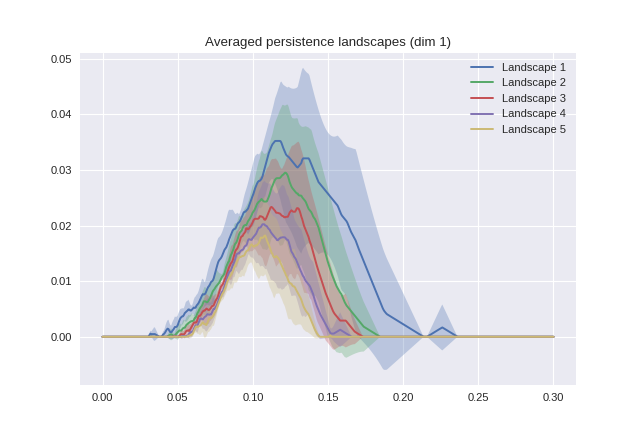

# MVA Topological Data Analysis

Topological data analysis (TDA) is the use of topology to analyze (potentially high-dimensional) datasets in a way that exploits topological features and invariants.




## TTK installation instructions (conda & Ubuntu)

My machine is an up-to-date Ubuntu 19.10 (eoan) with multiple Python environments managed by conda.

### Dependencies

The instructions on the course website have a few commands that will have the user install dependencies through `apt` that include or themselves have dependencies on Python apt packages (for instance VTK or Scikit-Learn). **That is not desirable if the user manages a complex system where Anaconda Python environments have priority over the system `apt` Python**.

The golden rule in that case is to never ever install Python dependencies through `apt` because your default interpreter is in a conda environment where `apt` packages won't be picked up/won't work.

If a system-wide (not necessarily Python) dependency is installed through conda then installing it through `apt` will have no effect: if you have `graphviz` packages installed through conda do not reinstall it through `apt`.

Install VTK in my base conda environment:
```bash
conda install -c conda-forge vtk
```
This makes it available system-wide.
The VTK configuration requires `libxt` to be installed. It's related to Xorg display server (standard issue on Ubuntu systems) can be installed system-wide using `apt` with no side effects (though you can also manage it using conda):
```bash
sudo apt install libxt-dev
```

Other dependencies that have no side effects can be installed through `apt`:
```bash
sudo apt install libeigen3-dev
sudo apt install qt5-default qttools5-dev
```

The tutorial says to update the Cmake flags `CMAKE_C_FLAGS=-luuid` and `CMAKE_CXX_FLAGS=-luuid` on Linux Mint (>19). That is also the case on Ubuntu 19+.

You also have to tweak where CMake finds the libraries to prevent conflicts and enable Scikit-Learn support (**note** Numpy's includes are found in `anaconda/lib/python3.x/site-packages/numpy/core/include`). Set CMake to force use the VTK bundled with Paraview.
